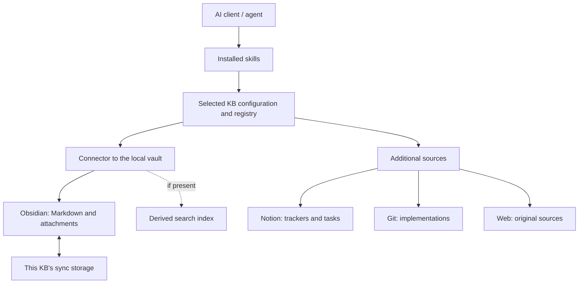
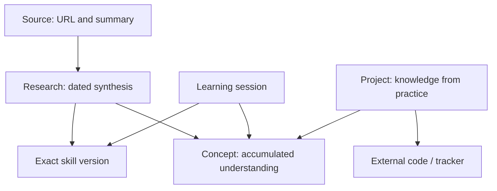

# Personal Knowledge System — Design & Contracts v1.10

## 1. Purpose and status

This document summarizes the discussed architecture: entities, component boundaries, Markdown file content, knowledge provenance, how agents work, package delivery and data storage. It complements `personal-knowledge-user-stories-v1.md` version 1.7 and describes the system without the user story format.

**Agreed** — a direction or behavior accepted in the discussion. **Example** — an illustration of such behavior, not a final data schema, API or command. **Open** — a technical decision that is yet to be made.

Exact directory names, YAML fields, commands, search models and integrations are not yet approved. The structures below make already discussed ideas concrete and do not add new mandatory technologies. The system is not implemented yet; the existence of a contract does not mean a working connection exists.

## 2. Key decisions

1. **Obsidian is the canonical store of accumulated knowledge.** Markdown notes, their metadata and attachments make up the user data.
2. **Notion, Git/GitHub and the Web are additional sources and functionality.** Statuses and tasks stay in the tracker, implementations in the repository, originals of external materials at their source links.
3. **Useful summaries and knowledge are saved to the knowledge base.** A link with a short summary is acceptable; copying a source in full is not required by default.
4. **Skills define the working rules.** An integration/connector/MCP provides access; the registry explains the purpose of sources to the agent.
5. **Context is retrieved selectively.** A brief learning profile and relevant notes are used instead of loading the whole vault.
6. **The project is delivered as an installable package with skills.** Source code, versions and CI are maintained on GitHub.
7. **The package and the knowledge bases are independent.** One local installation serves several separately initialized knowledge bases with their own settings.
8. **Skills are available in the user scope.** They can be used outside the project repository in supported clients.
9. **The vault is stored locally and synced separately.** Sync goes through separate cloud storage, not GitHub; the specific provider is still being chosen.
10. **The provenance of results is recorded.** The skill used and its version, the date and the sources can be determined; a later update is distinguishable from the original creation.

Central principle: **Obsidian stores knowledge, not the world.**

### 2.1. MVP decisions (v1.1)

11. **One user.** The author installs the package from their GitHub repository and updates it to new versions. The "another user" and "multiple knowledge bases" scenarios are not implemented in the MVP, but the architecture does not rule them out.
12. **Python + `uv`.** The package is a Python project; installation and updates from GitHub via `uv` (for example, as a `uv tool`; the specific command is not approved).
13. **Clients: Claude Code, Codex, Cursor.** All three have access to local files and a shell, so for one's own vault the MVP does without an MCP connector: the agent reads and writes Markdown directly and calls the package CLI. ChatGPT is excluded from scope (v1.5); notes on possible paths are in §12.2.
14. **Skills in a common format + installation adapters.** Skills are written once in a portable format (`SKILL.md`). Each client has its own installation method: for example, a Claude Code plugin, a user skills directory, entry instructions. The clients' current mechanisms are verified at the start of implementation.
15. **Writes only on explicit command.** Knowledge is saved when the user invokes the `add-knowledge` skill (working name); see §11.2.
16. **A new knowledge base from scratch.** There is no existing vault; the package creates one with an initialization command.
17. **Local vault, Google Drive sync as a separate step, not GitHub** (v1.2–v1.4). Notes are always written to a local folder outside Drive; the cloud copy is created separately (`kb sync` via `rclone` is recommended). The vault is not stored in any GitHub repository; GitHub serves only for package code. The MVP goal is a cloud copy in case of local deletion; phone access is deferred. Scheme — §12.1.
18. **Installation: a Python package that installs the skills itself** (v1.3). First install — `uv tool install` from GitHub, then `kb setup`; updating — a single command, `kb update`. Client plugins are not used in the MVP. Scheme — §4.1.
19. **Obsidian is not required for the package to work** (v1.3). The package and agents work with Markdown files directly; Obsidian is for the human to read and navigate, and can be installed at any time (§2.2).

### 2.2. What a vault is

An Obsidian vault is an ordinary folder with Markdown files and attachments. On first open, Obsidian creates a service folder `.obsidian/` in it with the app's settings. There is no special format or database: everything in the folder is notes, and they can be read and edited without Obsidian. Initializing the KB in this project means creating such a folder with the structure, templates, learning profile and configuration; synchronization with cloud storage is set up separately. In Obsidian, the folder is opened via "Open folder as vault".

There is no need to install Obsidian in advance: `kb init`, skills and agents (Claude Code, Codex, Cursor) read and write files without it. Obsidian adds convenience for the human: clickable `[[wiki-links]]`, Graph View, Canvas, rendering of Mermaid and attachments. Without it, notes remain plain Markdown that can be opened in any editor.

## 3. Components and their boundaries

| Component | Responsibility | What is not automatically attributed to it |
|---|---|---|
| Package repository | Source code, skills, templates, documentation, versions, CI | Storing users' personal knowledge |
| Installed package | Reusable tools for initializing and working with a KB | A separate copy of the source code for each knowledge base |
| User skills scope | Access to installed rules from different working directories | Automatic delivery of these rules to all AI clients |
| KB instance | Local vault, its own configuration and connections | Data shared with all other instances |
| Source Registry | Purpose of sources and choosing context for a task | Installing integrations or granting access |
| Skill | When to search, what to read, how to summarize and update | Technical implementation of file access |
| Connector / MCP integration | Client access to the corresponding knowledge base or external service | Mandatory presence of semantic search |
| Retrieval | Finding the right notes/fragments | Canonical storage of knowledge in place of Markdown |
| Search index, if used | A derived representation for search | An irreplaceable sole copy of knowledge |
| Sync storage | Exchanging changes of a specific knowledge base between the local vault and the storage | Storing the vault in the package repository |
| AI client / agent | Choosing operations, reading context and producing results according to the rules | Access to local data without the corresponding connection |

**Context Router** is the name discussed for the context selection logic. For now it is a role in the workflow, not a decision to create a separate service, class or agent.



The diagram shows logical dependencies, not a mandatory order in which every component is called. The agent consults additional sources as needed.

## 4. Package and knowledge base instances

### 4.1. Package delivery

The project repository maintains the library, the bundled skills, initialization tools, configuration templates/examples and documentation. The package is installed locally at a chosen version.

Installing the package and creating a knowledge base are different operations. The user installs the tools, then creates a new KB or connects an existing vault. Creating a second KB does not require a second installation of the package.

**Chosen scheme (v1.3).** The package is a Python project installed via `uv` as a tool with a CLI (provisional name `kb`). The package consists of two parts: a CLI for deterministic operations (init, search, note validation, maintenance) and skills (`SKILL.md`) with rules for the agent. The CLI itself installs the skills into the clients. Separate plugins for Claude Code, Codex and Cursor are not made in the MVP; a Claude Code plugin can be added later as an additional installation method from the same repository.

The commands below are illustrative; names are not approved:

| Action | Commands | What happens |
|---|---|---|
| First install | `uv tool install git+https://github.com/<owner>/<repo>`, then `kb setup` | The CLI is installed; `setup` asks which clients to install skills into and creates/connects the vault. Two steps are needed because `uv` does not run actions after installation |
| Update | `kb update` | One command: runs `uv tool upgrade`, then reinstalls the skills with the new version into all clients chosen during `setup` |
| Check | `kb doctor` | Shows the CLI version and the skills versions in each client, reports discrepancies and what to do |
| Specific version / rollback | `uv tool install --force git+…@vX.Y.Z`, then `kb setup` | The chosen tag is installed |

Skills installation decisions:

- **Skills are copied, not linked.** This way new skills from a new version are delivered, removed ones are cleaned up, and links do not break when a path inside the `uv` environment changes, for example when Python is updated.
- **The CLI manages only its own skills.** It keeps a list of the skills it installed and does not touch other skills in the clients' folders.
- **The package version is written into the skill copy.** The agent knows which version of the rules it is working with and writes it to provenance (§7). If the skill and CLI versions diverge (for example, the package was updated directly via `uv tool upgrade`), the skill warns about it before writing.
- User skills directories for each client are recorded in [clients-v0.md](clients-v0.md) (stage 0): `~/.claude/skills/` for Claude Code and `~/.agents/skills/` for Codex; Cursor reads both.
- If the repository is private, installation requires access to it (SSH or a GitHub token).

### 4.2. Logical contract of a KB instance

For each instance, the following are distinguishable:

| Part | Content |
|---|---|
| Instance selection | A name/identifier or another unambiguous way to select a KB |
| Local vault | Location of Markdown files and attachments |
| User configuration | Settings of this knowledge base and its sources |
| Connectors | Connections for working with this knowledge base and its supporting sources |
| Synchronization | Provider and location of this knowledge base's remote data |
| Learning context | A brief profile and detailed notes |
| Derived state | Index/sync state, if used |

This list defines what an instance consists of, but does not prescribe placing each part in a specific file.

**Configuration example; field names and values are provisional:**

```yaml
kb:
  name: ai-learning
  vault_path: /home/example/Knowledge/ai-learning

source_registry: /home/example/KnowledgeConfig/ai-learning/sources.yaml

connector:
  provider: "<chosen-integration>"

sync:
  provider: "<cloud-storage-not-github>"
  location: "<storage-for-this-kb-data>"
```

Access settings are set by the user. They are not distributed with the package source code. Another knowledge base uses a different vault and its own configuration. For any read/write operation it must be unambiguous which instance is selected; searching across all knowledge bases by default is not intended.

### 4.3. The other-user scenario

Another user gets the same package from the GitHub project, installs the skills, creates/connects their own KB and configures their own connectors and storage. Neither the author's personal vault nor their accounts are needed for this.

Logical sequence: **install a package version → initialize or connect a vault → configure sources and synchronization → install/connect skills to the client → verify access to the selected KB**. This describes the process, not ready-made CLI commands.

## 5. Knowledge base entities

### 5.1. Base note types

| Type | Purpose | Example content |
|---|---|---|
| `source` | Representation of an external source | URL, short summary, key takeaways, why it was saved |
| `research` | A dated synthesis of several sources | Comparison, table, conclusions, limitations, links |
| `concept` | Accumulated understanding of a concept | Explanation of RAG, links to retrieval and reranking |
| `learning-session` | Outcomes of a specific study session | Topics studied, recorded conclusions, remaining questions |
| `project` | Knowledge about a practical project | Goal, rationale for decisions, lessons learned, links to code/tracker |

`insight` was discussed as a useful observation from practice. **Decided in v1.7:** it is not a sixth type; insights go in an `## Insights` section of a `concept` or `project` note ([note-schema-v0.md](note-schema-v0.md) §2).

The type defines the purpose of the material, not necessarily a separate folder. Sources can be listed directly in a research note: a separate `source` note for each link is not required.

### 5.2. Links between entities

Links can exist as wiki-links and metadata. Discussed so far: topical relatedness (`related`), dependencies (`depends_on`), sources (`sources`), project context and a reference to the rules used for creation.



This is a semantic model of links. It does not require Neo4j and does not mean that an arbitrary YAML field is automatically shown in Graph View. The concrete representation of machine-readable links and their visualization are still being chosen; wiki-links are used for navigation between notes.

## 6. Markdown file contract

### 6.1. General shape

A note consists of metadata and readable Markdown text. The text can contain tables, wiki-links, Mermaid and links to attachments. A reader should understand the main meaning without having to reconstruct it from a search index.

Semantic parts of the contract:

| Part | Discussed meaning |
|---|---|
| Type | The note's purpose, one of the five base types |
| Title | A clear title for the material |
| Dates | Creation and update; the date a piece of research applies to |
| Topics/tags | Search and topical grouping |
| Provenance | Skill, the version used and a link to the exact rules |
| Sources | Links to external materials or related source notes |
| Links | Related concepts, research and project context |
| Body | Own summary, synthesis, explanation or session outcomes |

Mandatory fields per type, their names and the nesting schema are defined in [note-schema-v0.md](note-schema-v0.md) (v1.7). Agent/model/template metadata is allowed when known; missing values are not invented. Skill provenance applies to results processed through a skill and must not be fabricated for manually written material.

### 6.2. Example source note

The content below is illustrative: the URL points to a placeholder source and does not confirm any real research.

```markdown
---
type: source
title: "Agent Memory Architectures"
url: "https://example.org/agent-memory"
created: "2026-10-05"
updated: "2026-10-05"
topics:
  - agent-memory
  - rag
created_by:
  skill: research-summary
  skill_version: "1.2"
  skill_ref: "<link-to-exact-rules-version>"
---

# Agent Memory Architectures

## Summary

A short summary, in my own words, of the approach described in the source.

## Key takeaways

- How the approach differs from what I have already studied.
- Which limitations are worth checking.

## Why I saved it

The material is useful for researching agent memory architecture.

## Source

[Original material](https://example.org/agent-memory)

## Related

- [[Agent Memory]]
- [[RAG]]
```

What is stored here is a representation of the source, not its full text. To check the current state of the material, the agent opens the original.

### 6.3. Example research note

```markdown
---
type: research
title: "Agent Memory — comparison"
created: "2026-10-05"
updated: "2026-10-05"
topics:
  - agent-memory
created_by:
  skill: research-synthesis
  skill_version: "2.1"
  skill_ref: "<link-to-exact-rules-version>"
---

# Agent Memory — comparison

## Question and scope

How do the approaches under study differ in storage and retrieval?
The comparison applies to the stated date and the selected sources.

## Comparison

| Solution | Storage | Retrieval | Basis |
|---|---|---|---|
| Approach A | Per A's documentation | Per A's documentation | Link A |
| Approach B | Per B's documentation | Per B's documentation | Link B |

## Findings

Conclusions from the comparison, with assumptions marked.

## Limitations and open questions

What has not been verified and which questions remain.

## Sources

- [[source-approach-a]]
- [Approach B documentation](https://example.org/approach-b)

## Related

- [[Agent Memory]]
```

The table illustrates the shape of a synthesis and makes no claims about specific products. The research is tied to a date; durable conclusions can extend a concept note.

### 6.4. Examples of the other types

| Note | Possible sections | Content boundary |
|---|---|---|
| `concept`: RAG | Explanation, retrieval diagram, limitations, related concepts, basis | Accumulated understanding; dated comparisons go in a separate research note |
| `learning-session`: an MCP session | Topics, conclusions, what remained unclear, related notes | Records the session; does not attribute unconfirmed understanding to the user |
| `project`: Personal Knowledge Agent | Goal, decisions and reasons, knowledge gained, external links | Does not duplicate the issue tracker, source code and current PRs |

### 6.5. Visual content

The discussed split: text — Markdown; architecture diagrams — Mermaid; images/screenshots — attachments; topic overview — Canvas; links — Graph View. Excalidraw is possible as an extra and is not required.

Example image link: `![[rag-architecture.png]]`. When necessary, the important meaning of a picture is explained in text. Markdown text, a diagram and an image complement each other; the agent having access to the text does not imply it automatically understands every attachment.

The directory names below serve only as a placement example:

| Part of the vault | Example |
|---|---|
| Concepts | `concepts/RAG.md` |
| Short source cards | `sources/source-approach-a.md` |
| Syntheses | `research/agent-memory-comparison.md` |
| Learning outcomes | `learning-sessions/2026-10-05-mcp.md` |
| Project knowledge | `projects/personal-knowledge-agent.md` |
| Attachments | `attachments/rag-architecture.png` |
| Brief profile | `learning_profile.md` |

## 7. Provenance and versions contract

Provenance answers the questions: which sources the result was derived from, which skill and which version of it processed the material, when it was created/updated, and where to read the rules that were used.

Discussed so far: `skill`, `skill_version`, a link to the exact skill version, dates and sources. Additional `agent`, `model`, `template_version`/config are allowed when reliable values exist. The version number is recorded as a string; the values in the examples do not denote existing skills of the project.

The original creation and subsequent transformations are distinguishable. **An illustration, not an approved log format:**

```yaml
created_by:
  skill: research-synthesis
  skill_version: "2.1"
  skill_ref: "<exact-rules-v2.1>"

updates:
  - date: "2026-10-05"
    skill: research-synthesis
    skill_version: "3.0"
    skill_ref: "<exact-rules-v3.0>"
```

A link to a mutable "current skill" does not explain the rules of an old note. **Decided in v1.7:** `skill_ref` links to the `SKILL.md` file at the package's Git release tag; no separate snapshots are kept ([note-schema-v0.md](note-schema-v0.md) §3).

| Version | What it denotes |
|---|---|
| Package version | A release of the library, distribution and installation tools |
| Skill version | The rules of a specific knowledge transformation |
| Configuration schema version | Compatibility of a KB instance's settings |
| Note version/history | Changes to the content of a specific piece of material |
| Design document version | The state of recorded agreements |

These versions are not interchangeable. The skill itself + provenance provide traceability of rules and sources; they do not guarantee bit-for-bit reproduction of an LLM response. The policy for note history and updating their metadata is still being refined.

## 8. Source registry contract

The registry separates the primary knowledge base from supporting sources. It explains where to go for a specific fact and how to reconcile results in case of conflict.

**An example registry, developing the discussed `sources.yaml`; not a final schema:**

```yaml
knowledge_base:
  provider: obsidian
  role: canonical_knowledge
  priority: primary
  access:
    method: "<local-or-mcp>"
    connector: "<connection-to-selected-kb>"
  use_for:
    - concepts
    - research
    - learning_history
    - project_knowledge

supporting_sources:
  tracking:
    provider: notion
    role: operational
    access:
      method: mcp
      connector: "<user-connection>"
    resource: "<id-of-the-relevant-tracker>"
    use_for:
      - application_status
      - tasks
      - trackers

  code:
    provider: github
    role: operational
    resource: "<repository-with-implementation>"
    use_for:
      - source_code
      - issues
      - pull_requests
      - implementation_state

  web:
    role: external
    use_for:
      - current_information
      - documentation
      - research_sources
```

Listing a source does not create a connection, grant permissions or guarantee that the needed tool is available. The registry belongs to the configuration of a specific KB; the distributed package contains only an example.

### 8.1. Authority rules

| Fact requested | Primary basis for the answer |
|---|---|
| What the user has already studied and which questions they recorded | Notes/learning profile of the selected KB |
| Accumulated explanation and the reasons for a decision | The corresponding note in Obsidian |
| Current status of a job application or task | The corresponding tracker |
| How the implementation is structured right now | Code/state of the corresponding repository |
| Current documentation or state of an external product | The original, up-to-date source |

Obsidian's priority is the priority of the knowledge base within the system, not a rule to trust an outdated summary over the current state of an external service. For a mixed request, knowledge and current context are combined with distinguishable provenance.

### 8.2. Links to external context

A project or research note can specify related external resources.

```yaml
type: project
topics:
  - personal-knowledge-system
external_context:
  github:
    repo: "<implementation-repository>"
    issue: "<related-issue>"
  notion:
    project: "<related-project-or-tracker>"
```

Such a link connects knowledge with practice. It does not mean copying the content of the issue/tracker into Obsidian.

## 9. Skills, connectors and entry instructions contract

A skill defines a scenario: when to look for past knowledge, which sources to use, how to produce a summary/synthesis, how to update an existing note and record provenance. A specific split into learning/research/job-search/software-project skills was discussed as an option, not as an approved list of what ships.

A possible declaration of skill dependencies:

```yaml
required_sources:
  - tracking
optional_sources:
  - knowledge_base
```

This is an example of context requirements for an operational task, not the final `SKILL.md` format. Source names must correspond to the registry of the selected knowledge base. A skill does not assume access to a source just because it is listed in YAML.

Entry instructions point the agent to the rules and the registry. `AGENTS.md` was discussed; how it is loaded depends on the AI client. A new agent must receive the instructions and the technical connections, not just a file name.

The gist of the discussed entry instruction:

> To work with the user's knowledge, select a KB and read its source registry. Use Obsidian as the canonical knowledge layer. For current statuses, tasks and implementation, go to the corresponding supporting sources. Do not duplicate their content in the KB; save useful synthesis and knowledge with provenance.

Local skills are installed into the user scope and can be used in different repositories. For ChatGPT/a remote client, a way to deliver these rules and access to the selected knowledge base are needed separately. Neither universal support for `AGENTS.md` nor automatic access to the local vault is assumed.

**MVP (v1.1, refined in v1.5):** skills and the CLI work in Claude Code, Codex and Cursor. ChatGPT is out of scope (§12.2). Skills find the vault through the package's user configuration, not through the current working folder: a skill can be invoked from any repository. The installation mechanism for each client is implemented as a separate adapter; specific directories and plugin formats are verified during implementation.

### 9.1. AI component architecture (v1.6)

The solution is built on **skills + CLI**. MCP, subagents and hooks are not used in the MVP, but the architecture allows adding them without reworking the core.

**Separation principle:** everything that can be checked by code is done by the CLI; everything that requires understanding text is done by a skill (LLM).

| Layer | Responsibility | MVP |
|---|---|---|
| Core: Python library + `kb` CLI | Locating the vault via configuration, search by frontmatter and text, creating/extending notes from templates, **stamping provenance** (skill, version, date), schema validation, duplicate detection, skills installation, synchronization | Yes |
| Skills (`SKILL.md`) | Summarizing the conversation, classifying by type, the "create or extend" decision, wording the text, marking confirmed vs. assumed | Yes: `add-knowledge`, `kb-recall` |
| Global instruction (`AGENTS.md` / `CLAUDE.md` / Cursor user rules) | A short pointer telling the agent that the knowledge base exists and which skills apply | Yes, installed via `kb setup` |
| MCP server | The same core operations as typed tools for clients without a shell (ChatGPT, phone, remote agents) | No; a thin wrapper over the core later |
| Subagents | A "librarian" (searching a large vault and returning only the needed fragments), parallel reading of sources for `research` | No; an optional improvement for clients that support them |
| Hooks | For example, a "save knowledge?" reminder before context compaction (PreCompact in Claude Code); automatic writing is not allowed | No; an optional improvement |

Important constraints:

- **Provenance is stamped by the CLI, not the model.** The skill, version and date values come from the installed package, which rules out invented metadata (US-12).
- **A subagent does not see the main conversation.** The summary for `add-knowledge` is produced only by the main agent; source search and reading can be delegated to subagents.
- **Skills are written to degrade gracefully:** if subagents or hooks are not available in a client, the skill performs the steps itself.
- **The CLI writes the notes (decided in v1.8).** The skill passes the content to `kb new` / `kb extend`; the CLI renders the note, stamps provenance, validates it and only then writes it. `kb extend` only appends to sections and lists, so existing text is never rewritten. The agent does not edit note files with its own tools.

## 10. How the agent reads context

1. Determines the task and the selected KB.
2. For personal/learning context, finds the profile and relevant knowledge; for an operational fact, selects a supporting source via the registry.
3. Searches for relevant notes/fragments by text, metadata, types and links; semantic search is possible if a corresponding backend exists.
4. Reads the material found, not the whole vault.
5. If needed, gets up-to-date information from an external source.
6. Forms an answer taking what was found into account and flags unavailable/unverified context.

| Request | Expected context selection |
|---|---|
| "Let's continue studying Transformers" | Learning profile, concept notes and past learning-session notes |
| "Which approaches to agent memory have I researched?" | Primarily research notes on the corresponding topic |
| "What's the application status and what did we decide about the strategy?" | Status from Notion plus knowledge/conclusions from Obsidian |
| "What is 15 × 18?" | No additional KB search is needed |

The learning profile is a small context with current directions, known topics, recently studied material and open questions. It links to detailed notes and does not replace them. How the profile is loaded (always or conditionally) is still being chosen.

Retrieval describes the process of extracting context and does not imply mandatory use of embeddings. Text/semantic/hybrid search and the specific backend for the first implementation are open. Third-party Obsidian plugins mentioned earlier were examples of possible implementations; none of them is chosen by this document.

## 11. How the agent saves and updates knowledge

1. Determines whether the result is knowledge, a short source card, research, a session summary or operational state.
2. For knowledge, searches for existing material in the selected KB.
3. Creates a new note or extends a suitable one without repeating what is already written.
4. Preserves links/basis and processing provenance; contradictions are distinguishable from the previous conclusion.
5. If a search index exists, updates it for the changed content.
6. Synchronization propagates the change via the separately chosen mechanism; running sync after every write is not approved.

| Input result | Placement |
|---|---|
| An article worth remembering | URL and own summary in a `source` |
| A comparison of several sources | A dated `research` with links |
| A durable explanation | Creating/extending a `concept` |
| A session summary and remaining questions | `learning-session`, plus the profile if needed |
| A new task/application status | The corresponding external system |
| A confirmed conclusion from practice | A knowledge note referencing the external basis |

**Write policy (decided in v1.1):** writing happens only on explicit skill invocation by the user. The invocation itself is the permission to write. The agent does not create or change notes on its own initiative, and there is no automatic saving. **Decided in v1.8:** new notes are created right away; before extending existing notes, the skill shows a plan (note, sections, what is added) and waits for the user's confirmation.

Filtering by skill/version makes it possible to find old materials. Updating with a new skill or with current sources keeps the original creation and the new processing distinguishable. Automatic regular rebuilds of all research are not approved.

### 11.1. Logical access operations

The capabilities discussed are **search, read, create/update/merge**. This is a contract for the purpose of the operations, not a ready MCP schema:

| Operation | Meaning |
|---|---|
| Search | Find suitable materials in the selected KB, taking available filters into account |
| Read | Get the content of a selected note or fragment |
| Create | Create new material in the corresponding knowledge base |
| Update/merge | Add/revise knowledge in existing material according to the skill's rules |
| Init | Create a separate instance with its configuration or connect an existing vault |
| Sync | Exchange changes of a specific knowledge base with its storage |

Exact tool names, arguments, response formats and the split between the library and an existing plugin have not yet been chosen. It is not assumed that an installed third-party connector already provides all these operations.

### 11.2. The `add-knowledge` skill: saving conversation outcomes

The main MVP scenario (US-24): the user spends a long time working through a topic in a chat and at the end invokes `add-knowledge` to collect the result into the knowledge base.

1. **Collection.** The agent goes through the conversation (in full or for a specified topic) and extracts: the original question, explanations and conclusions, comparisons, mentioned sources, open questions. Unconfirmed points are marked as assumptions.
2. **Classification.** The material is distributed by type: the summary — `learning-session`; a durable explanation — `concept`; a dated comparison — `research`; significant external material — `source` or a link within a note.
3. **Searching for existing notes.** For each topic the agent searches for notes in the vault (via the package CLI or file search) and chooses between "create" and "extend".
4. **Writing.** Creating new notes and extending existing ones without repetition, with frontmatter, wiki-links and provenance (`created_by` or an entry in `updates`).
5. **Report.** The agent lists the created and changed files. Updates the learning profile if needed.

Limitation: the agent sees only what is currently in its context. If the client has compacted a long conversation (context compaction), early details may be available only in abbreviated form. Whether to take into account transcripts saved by the client (if they exist on disk) is an open implementation question.

A single run can create several notes: for example, a `learning-session` + extending two `concept` notes + one `source`.

## 12. Synchronization, isolation and GitHub's roles

The local vault remains the accessible copy of the knowledge. Synchronization transfers changes in both directions through separate cloud storage. **GitHub is not used for storing or syncing the vault** (decided in v1.2): notes and attachments go into neither the package repository nor a separate repository. The specific provider (for example, Google Drive, iCloud, Obsidian Sync) and mechanism have not yet been chosen. One sync mechanism is used per vault: two mechanisms on the same folder conflict.

GitHub has two roles in the system, and neither is related to storing knowledge:

| Role | What is stored | Relation to the KB |
|---|---|---|
| Repository of the distributed package | Library code, skills, templates, CI | Tools that work with the KB |
| Supporting code source | Code/issues/PRs of a practical project | External basis for project knowledge; the KB holds only links and conclusions |

Without a Git repository, the vault has no built-in history of note changes. Whether it is needed and how to provide it (the provider's version history, local history without a remote repository, or something else) remains an open question (§14). **Under consideration (v1.9):** a separate private Git repository for the vault as its history and backup, which would revise the exclusion of GitHub above — §12.3. Protection of the data itself against accidental deletion — §12.4.

### 12.1. Local vault and Google Drive sync (v1.4)

**The vault is stored locally** — in an ordinary folder outside Google Drive (for example, `~/Knowledge/main`). All agents and the CLI write only to the local folder. Syncing with Google Drive is a separate step that does not affect writing notes. **The MVP goal is a cloud copy of the knowledge base**, so that knowledge is not lost to accidental local deletion or loss of the computer. Access from other devices, including the phone, is deferred.

**Recommended mechanism: `kb sync` via `rclone`** (a proposal, to be confirmed during implementation):

| Direction | What happens |
|---|---|
| Local vault → Drive (`kb-backup/`) | One-way copy. A local deletion does not delete the cloud copy; old versions of changed and deleted files are moved to a separate archive folder on Drive |

- `kb sync` is run manually; running it on a schedule or after `add-knowledge` is an open question.
- One-time setup: installing `rclone` and authorizing Google Drive.
- The cloud copy is a backup, not a working copy: editing files directly in `kb-backup/` is not intended, so two-way sync conflicts do not arise.

**No-code alternative:** backing up the local folder with Google Drive for desktop. Downsides: deletions probably propagate to the cloud too, and the process cannot be controlled from `kb`.

**Phone (deferred).** With the one-way scheme, the cloud copy is read-only. Mobile editing will require a separate decision when it becomes necessary.

### 12.2. ChatGPT — out of scope (v1.5)

ChatGPT is excluded from scope at this stage to avoid complicating the MVP. The research results are kept for the future:

- **ChatGPT desktop app (Work mode, local project).** After the merger with Codex (July 2026), local Work conversations, according to the release notes, work with local folders and pick up `AGENTS.md` and skills in the project's root folder. This is the simplest future path: ChatGPT becomes a local client just like Codex. Needs verification.
- **Web/mobile ChatGPT.** Cannot write to the local vault. A possible path is a cloud inbox: ChatGPT creates an `.md` file in Google Drive, `kb sync` pulls it into a local `inbox/`, and `add-knowledge` processes it. Depends on whether the Drive connector can create files.
- **A custom MCP with write access** is not available on the Plus plan (according to OpenAI's help center — only Business/Enterprise/Edu).

If the connection is lost, local data is preserved. Diverging changes are detected; silently losing a version is not allowed. The specific conflict resolution rules are open. Synchronization is not considered a complete backup solution.

The index, if used, is derived state that can be rebuilt from the notes. Transferring it is not a condition for preserving canonical knowledge. Indexes, configuration and sync state of different instances are not mixed by default.

### 12.3. Under consideration: Git as the vault's history and backup (v1.9)

**Status: open, not decided.** This section records a proposal for further consideration. Until the decision is made in roadmap stage 4, §12 and §12.1 remain the current baseline. The original reason for excluding GitHub (v1.2) was not recorded, so the exclusion is reconsidered on its merits.

**Why Git fits this vault:**

- Notes are plain Markdown text: Git gives diffs, full history and restoration of deleted files out of the box (`git log --diff-filter=D`, `git checkout <commit>^ -- <path>`). This also answers the open "note change history" question (§14, US-13).
- All agent writes go through the CLI (§9.1), so `kb` can commit after every successful write with a message carrying provenance, for example `add-knowledge v0.3.0: extend concepts/RAG.md`. The history becomes a log of which skill and version changed what (§7, US-12).
- A private GitHub repository is an off-machine copy, just like Google Drive. For a single user, both are third-party services, so privacy does not clearly favor either.

**Proposed scheme (an example, not an approved contract):**

| Part | What happens |
|---|---|
| Local history | The vault root is a Git repository of its own (never the package repository or a project repository). `kb` commits after each `kb new` / `kb extend` |
| Changes outside `kb` | Edits and deletions made in Obsidian or the file manager are committed by `kb sync` (`git add -A`), on a schedule or via an Obsidian Git plugin — to be decided |
| Off-machine copy | `kb sync` pushes to a private GitHub repository dedicated to this vault |
| Restore | `kb restore <path>` returns a deleted or damaged note from history |
| Second independent copy | Time Machine (free, already on macOS); Google Drive becomes optional |

**Options to choose from:**

1. **Git + private GitHub only** (recommended for the MVP): history, deletion recovery and an off-machine copy with one mechanism; Time Machine as the second copy.
2. **Git + GitHub + Google Drive**: two independent cloud copies. Both are one-way, so they do not conflict (unlike two two-way sync mechanisms, §12), but setup is heavier (`rclone`, Google authorization).
3. **Google Drive only** (current §12.1): a cloud copy with an archive of old versions, but no convenient change history.

**Risks and mitigations:**

| Risk | Mitigation |
|---|---|
| Git is not a backup by itself: an agent may run `git push --force` or `git reset --hard`; force-push protection for private repositories may require a paid GitHub plan (to verify) | Only `kb` runs Git in the vault; skills forbid Git commands there; a second independent copy (Time Machine or Drive) |
| Binary attachments bloat the repository; GitHub rejects files over 100 MB | Ignore large files in `attachments/` via `.gitignore`, or use Git LFS |
| Secrets pasted into a conversation end up in a note and are pushed | A simple check for key-like strings in `kb` before committing; notes must not contain secrets |
| Phone access through Git is inconvenient | Phone access is deferred (US-20); Drive can be added later for it |

**What changes if the proposal is accepted:** decisions 9 and 17 (§2), §12/§12.1, §14, US-20 and the GitHub boundaries in the requirements; the `kb doctor` warning about Git (it should warn only when the vault is inside a *foreign* repository, not when the vault root is its own repository); the sync section of the configuration (`provider = "git"` with a remote instead of `provider = "rclone"`).

### 12.4. Data integrity: protection against accidental deletion (v1.9)

**Status: open, for further consideration together with §12.3.** Files in the vault fall into two classes that need different protection:

| Class | Files | If deleted |
|---|---|---|
| Regenerable | Folders, `templates/*.md`, `README.md` | `kb doctor` reports them; `kb init` recreates them |
| User data | All notes and `learning_profile.md` (extended by `kb extend`) | Cannot be regenerated; restore only from history or a backup |

`learning_profile.md` is currently created by `kb init` like a regenerable file. If it is deleted, `kb doctor` suggests `kb init`, which silently recreates an empty profile and hides the loss. It must be treated as user data: `kb doctor` points to a restore instead, and `kb init` recreates it only on a fresh vault or with an explicit flag. **Done in v1.10 (roadmap stage 2):** `kb init` and `kb setup` create the profile only for a new vault (not yet in the configuration and without notes); on a vault in use a missing profile is reported as `missing` with a restore hint, `kb doctor` reports it as an error pointing to a backup, and `kb init --new-profile` creates an empty one on request.

Protection of user data in three layers:

- **Prevent.** The CLI has no delete command and extends append-only (§11). Skills forbid deleting, moving or renaming vault files and any change outside `kb`. Optionally, client permission rules deny direct edits of the vault path (they do not cover shell commands such as `rm`).
- **Detect.** `kb doctor` / `kb validate` report broken wiki-links (a deleted note leaves dangling `[[...]]` links), and compare the vault with a manifest of notes written by `kb` (kept outside the vault, next to `installed.toml`) to list notes that disappeared.
- **Recover.** From Git history (§12.3) and/or the cloud copy (§12.1). Whatever the mechanism, a local deletion must never propagate to the copy without an archived version (for `rclone`: `--backup-dir` or `copy`, never a plain `sync`). The copy is updated automatically after each write, not only manually.

## 13. Versions, CI and package maintenance

The package version is tied to a state of the source code. The installed version can be determined; a chosen release can be installed in a documented way. The release history distinguishes changes to skills, compatibility and configuration schemas.

CI checks essential scenarios: building/installing the package, presence of skills, KB initialization and independence of multiple instances. Checks use test data and do not depend on the author's personal knowledge.

Updating the package does not overwrite user Markdown files. Configuration changes, if needed, require a documented migration path. The distribution channel, versioning policy and CI technology are still being chosen. CD/automatic publishing was discussed as a possible future development, not as a mandatory, already chosen part.

## 14. Open decisions and boundaries of the current design

| Area | What is already settled | What is still being chosen |
|---|---|---|
| Delivery | Python package on GitHub, installation via `uv tool install` + `kb setup`, updating with a single `kb update` command, skills are copied into clients; one user in the MVP; skills directories — [clients-v0.md](clients-v0.md) | Final command names |
| Instances | Several separate local KBs per installation (target); one new KB in the MVP | Identifier format and selection of the active KB |
| Configuration | Each knowledge base has its own source/storage settings; TOML at `~/.config/ms-kb/config.toml` ([note-schema-v0.md](note-schema-v0.md) §6) | Source registry format |
| Markdown | Five types, metadata, links, attachments; fields and directory structure — [note-schema-v0.md](note-schema-v0.md); `insight` is not a type | — |
| Provenance | Skill/version, sources, dates, exact rules via a link at the release tag; stamped by the CLI | Note content history |
| Search | Selective retrieval instead of loading the whole vault | Text/semantic/hybrid, model and backend |
| Access | Direct access to vault files from Claude Code/Codex/Cursor in the MVP; connectors to supporting sources | MCP for remote clients after the MVP |
| Skills | Shipped with the package and the user scope; portable `SKILL.md` format and install directories — [clients-v0.md](clients-v0.md); the first skill is `add-knowledge` | The rest of the skills list; Cursor duplicates and global instruction |
| Learning profile | Brief context separate from detailed knowledge | Format and loading conditions |
| Writing | Explicit skill invocation only; create/extend without duplication; the CLI writes notes and extends append-only; a plan is shown before existing notes are extended | — |
| Synchronization | Local vault; cloud copy in Google Drive as a separate step; GitHub excluded for the vault (under reconsideration, §12.3) | Git + private GitHub vs Google Drive vs both (§12.3); how sync is triggered; mobile access (deferred); note change history |
| Data integrity | The CLI never deletes and extends append-only; regenerable vs user-data files, the learning profile is never silently recreated (§12.4) | Detection of deleted notes, restore (§12.4) |
| ChatGPT | Out of scope at this stage | Possible future paths — §12.2 |
| Maintenance | Versions and CI | Release process, migrations, whether CD is needed |

A separate Qdrant/vector DB, Neo4j, mandatory Excalidraw, copies of the whole Web/Notion/Git and permanently loading the whole vault are not among the accepted mandatory decisions. This document does not choose new technologies or install integrations; it records the current model and semantic contracts for the next design step.

## 15. Document history

- **1.0 — 2026-10-05:** initial version based on requirements v1.2.
- **1.1 — 2026-10-09:** synced with requirements v1.3. Added §2.1 "MVP decisions" and §2.2 "What a vault is", approved the write policy, added §11.2 on the `add-knowledge` skill, updated §9 and §14.
- **1.2 — 2026-10-09:** synced with requirements v1.4. GitHub excluded as vault storage: sync only through separate cloud storage, and GitHub keeps two roles (package code and supporting source). Updated §2, §2.1, §2.2, §4.2, §12, §14.
- **1.3 — 2026-10-09:** synced with requirements v1.5. Installation and update scheme (§4.1): `uv tool install` + `kb setup`, updating via `kb update`, copying skills, `kb doctor`. Sync provider — Google Drive, MVP goal — a cloud copy against accidental deletion, mobile access deferred; added §12.1. Recorded that Obsidian is not required for the package to work (§2.2). Fixed the order of subsections §11.1/§11.2.
- **1.4 — 2026-10-09:** synced with requirements v1.6. The vault is stored locally outside Google Drive; sync is a separate step (§12.1 rewritten, a one-way `kb sync` via `rclone` with a version archive and inbox pickup recommended). Added §12.2: ChatGPT as a source of materials via a cloud inbox. Updated §2.1, §9, §14.
- **1.5 — 2026-10-09:** ChatGPT excluded from scope: §12.2 reduced to notes on future paths (desktop Work, cloud inbox, MCP), inbox pickup removed from `kb sync`. Updated §2.1, §9, §14.
- **1.6 — 2026-10-09:** added §9.1 "AI component architecture": skills + CLI in the MVP; MCP, subagents and hooks later as extensions; provenance is stamped by the CLI.
- **1.7 — 2026-10-09:** roadmap stage 0: note schema, vault structure and configuration moved to `note-schema-v0.md`, client paths to `clients-v0.md`. Decided: `insight` is not a type (§5.1), `skill_ref` points to the release tag (§7), configuration is TOML (§14). Updated §4.1, §6.1, §14.
- **1.8 — 2026-10-09:** roadmap stage 2: the CLI writes notes (`kb new`, append-only `kb extend`), the skill passes content (§9.1); a plan is shown before extending existing notes (§11). Updated §14.
- **1.9 — 2026-10-10:** for further consideration: §12.3 — Git with a private GitHub repository as the vault's history and backup (revises the v1.2 exclusion of GitHub; not decided); §12.4 — data integrity: regenerable vs user-data files, `learning_profile.md` as user data, detection and recovery of deleted notes. Updated §12, §14.
- **1.10 — 2026-10-10:** §12.4: regenerable vs user-data files implemented for `learning_profile.md` (roadmap stage 2). Updated §14.
