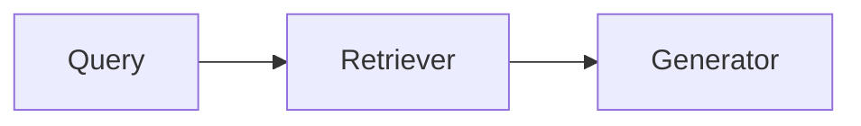

# {{title}}

## Explanation

What the concept is, in my own words.

## Diagram

<!-- Delete this section if a diagram does not help. Example:

Images go in attachments/ and are embedded like this:
![[example.png]]
Explain the important meaning of the image in text below it, so the agent can use it too.
-->

## Limitations

## Insights

## Related
