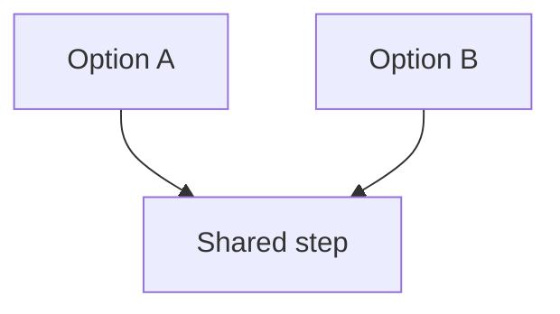

# {{title}}

## Question and scope

The question, and the date and sources the comparison applies to.

## Comparison

| Option | Criterion 1 | Criterion 2 | Basis |
|---|---|---|---|
|  |  |  |  |

<!-- A diagram can help too. Example:

-->

## Findings

Mark assumptions explicitly.

## Limitations and open questions

## Sources

## Related
